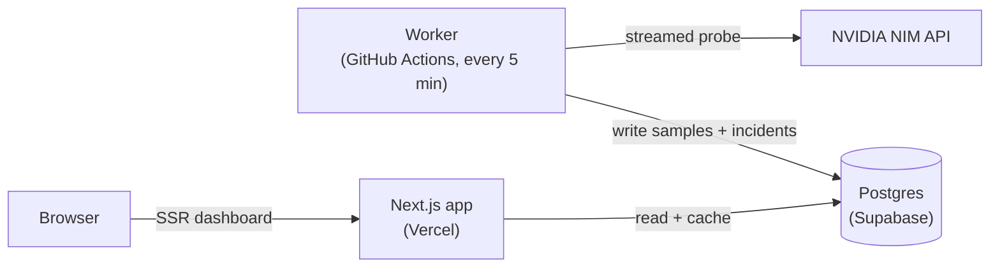

<div align="center">

# NIM Stats

**Live reliability dashboard for free NVIDIA NIM API endpoints.**

Probes every available endpoint continuously and surfaces throughput, latency, uptime, and congestion — so you can pick a model that actually works right now, without trial and error.

[**Live demo → nim-stats.vercel.app**](https://nim-stats.vercel.app)


</div>

---

NIM Stats is a public operational dashboard for the free [NVIDIA NIM](https://build.nvidia.com) chat-completion endpoints (Llama, Mistral, Gemma, Phi, Qwen, DeepSeek, and more). A background worker streams a small probe against each endpoint on a schedule, measures real time-to-first-token and decode throughput, classifies the result, and persists it. The dashboard reads that telemetry and renders fleet health that's scannable in about five seconds — no login, no setup.

## Features

- **Real-time fleet status** — every endpoint classified `healthy` / `busy` / `jammed` from live probes, with color + shape + text (color-blind safe).
- **Deep reliability metrics** — TTFT, throughput, uptime, congestion, p95/p99 latency, timeout rate, session reliability, volatility, routing confidence, and queue pressure.
- **Trends & history** — fleet performance chart (12h / 24h / 7d), per-model uptime calendar, time-of-day latency heatmap, and SLA windows (1d / 7d / 30d).
- **Incident feed** — state transitions (degradation, congestion, recovery) recorded as the worker observes them.
- **Explore the fleet** — search, provider/status filters, favorites/watchlist, saved filter presets, shareable URL state, and CSV export.
- **Public status page** at [`/status`](https://nim-stats.vercel.app/status) — a read-only, at-a-glance health summary.
- **Anomaly & quota detection** — TTFT spikes and reliability drops vs. a 7-day baseline, plus rate-limit proximity, exposed via internal APIs.

## How it works

The collector is decoupled from the web app: it writes telemetry to Postgres, and the dashboard server-renders straight from the database.



- **Worker** (`scripts/probe-once.ts`) discovers active endpoints, probes each one (rate-capped under NIM's 40 req/min limit), classifies the operational state, and stores a `ModelSample`. A daily pass prunes old samples and retires dead endpoints.
- **Database** holds raw samples, the latest snapshot per model, and incidents. Derived analytics are computed at read time.
- **Web app** renders Server Components directly from the database, wrapped in a short-lived data cache so concurrent traffic collapses to roughly one query per window.

> [!NOTE]
> The dashboard only shows data once the worker has run at least once. Locally that means running `npm run worker`; in production, GitHub Actions handles it on a schedule.

## Tech stack

| Layer | Choice |
|---|---|
| Framework | Next.js 16 (App Router, Turbopack), React 19 |
| Styling | Tailwind CSS v4, shadcn/ui + Radix |
| Charts | Recharts |
| Data | Prisma 7 + PostgreSQL (`@prisma/adapter-pg`) |
| Collector | Node + `node-cron` (local) / a one-shot script (CI) |

## Getting started

### Prerequisites

- Node.js 20+
- A PostgreSQL database (local or hosted)
- A free NVIDIA NIM API key from [build.nvidia.com](https://build.nvidia.com) (`nvapi-…`)

### Setup

```bash
# 1. Install dependencies
npm install

# 2. Configure environment
cp .env.example .env
#   then set NIM_API_KEY and DATABASE_URL in .env

# 3. Create the schema
npx prisma migrate deploy

# 4. Start the collector (terminal 1) — required for data
npm run worker

# 5. Start the dashboard (terminal 2)
npm run dev
```

Open [http://localhost:3000](http://localhost:3000). Data appears within a minute of the worker's first cycle.

### Scripts

| Command | Description |
|---|---|
| `npm run dev` | Start the dev server on `localhost:3000` |
| `npm run build` | Production build (runs `prisma generate` first) |
| `npm run worker` | Run the always-on collector (local dev) |
| `npm run probe:once` | Run a single probe cycle and exit (used by CI) |
| `npm run lint` | Lint with `eslint-config-next` |

## Configuration

Set in `.env` (see [`.env.example`](.env.example) for the full list):

| Variable | Required | Description |
|---|---|---|
| `NIM_API_KEY` | yes | NVIDIA NIM API key (`nvapi-…`) |
| `DATABASE_URL` | yes | PostgreSQL connection string |
| `NIM_API_URL` | no | Defaults to `https://integrate.api.nvidia.com` |
| `INTERNAL_API_TOKEN` | prod | Locks down non-browser API routes; sent as `Authorization: Bearer <token>` |
| `PROBE_MAX_RPM` | no | Outbound probe rate cap (default `30`; NIM allows 40) |
| `RETENTION_DAYS` | no | Prune samples older than this (default `30`) |

## API

Public (no auth):

| Route | Description |
|---|---|
| `GET /api/fleet/trend?range=12h\|24h\|7d` | Fleet-wide time series |
| `GET /api/fleet/reliability` | Per-model uptime / heatmap / SLA breakdown |
| `GET /api/health` | Liveness + last probe time |

Internal (require `INTERNAL_API_TOKEN` in production): `/api/fleet/anomalies`, `/api/fleet/quota`, `/api/fleet/overview`, `/api/models`, `/api/models/[id]`, `/api/providers`.

## Deployment

NIM Stats is designed to run on entirely free tiers — **Vercel** (web), **Supabase** (Postgres), and **GitHub Actions** (the worker, on a public repo). See [`PRODUCTION.md`](PRODUCTION.md) for the architecture, the data-volume math, and step-by-step deploy instructions.

> [!IMPORTANT]
> The worker runs as a scheduled GitHub Actions job (Vercel has no always-on process). Use Supabase's **pooled** connection for the app and the **direct/session** connection for the worker and migrations.

---

<div align="center">
<sub>Not affiliated with NVIDIA. Status reflects independent probing of public endpoints.</sub>
</div>
